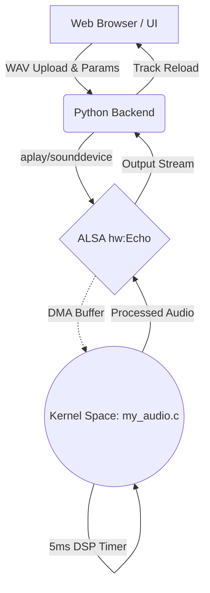

<div align="center">

# ECHODRIVER: Kernel-Space DSP Engine
**A High-Speed Virtual ALSA Reverb Sound Card & Web Visualizer**

[](https://kernel.org)
[](#)
[](#)
[](#)
[](#)

*Pushing audio processing from user-space into the absolute depths of the Linux Ring Buffer.*

[Features](#core-features) | [Installation](#installation) | [Architecture](#architecture) | [Usage](#usage)

---

</div>

## The Concept

**EchoDriver** is a complete, full-stack audio processing pipeline built entirely from scratch. 
Instead of relying on slow user-space libraries to apply audio effects, EchoDriver intercepts audio streams at the **ALSA kernel level**, applies a real-time Digital Signal Processing (DSP) reverb comb-filter directly inside the DMA ring buffer, and shoots the processed audio back up.

Paired with a modern **Web-based Visualizer** (featuring real-time FFT analysis and instant client-side decoding), it allows you to control a Linux kernel module seamlessly from a browser.

---

## Core Features

### 1. Kernel-Level DSP Engine (my_audio.c)
- **High-Speed 5ms Timer:** The simulated hardware interrupts fire every 5ms, processing `rate/100` frames per tick. This accelerates processing to run at **~2x real-time speed**, cutting rendering time in half compared to standard loopback drivers.
- **Dynamic Sample Rates:** Unlocked `hw_params` matrix allows native processing of any standard sample rate (`8kHz` to `192kHz`) and `16-bit` mono/stereo audio without user-space resampling.
- **Sysfs Real-Time Controls:** Modify Reverb `delay_ms`, `decay`, and `wet` mix directly via `/sys/kernel/my_audio/` while audio is streaming.
- **Zero-Copy Architecture:** DSP logic acts directly on the ALSA-negotiated DMA pointers.

### 2. The Python Bridge (test_echo.py)
- Python backend securely interfacing with the `hw:Echo` ALSA card using full-duplex, non-blocking streams.
- Deep metadata extraction formatted dynamically into JSON for frontend consumption.

### 3. Web Visualizer (visualizer.py)
- **Instant Client-Side Decoding:** Web Audio API decodes dropped files locally to display file size, sample rate, channels, and duration *before* server upload.
- **Real-Time FFT:** Live spectrum analysis of both the Original and Reverb-processed audio tracks.
- **Dynamic Progress Tracker:** Tracks loopback capture and estimates the kernel processing time in real-time.

---

## Architecture Flow



---

## Setup & Installation

### Prerequisites
- Linux OS with Kernel Headers installed.
- Python 3.x with `pip`.
- GCC & Make toolchain for Kernel Module compilation.

### Step 1: Compile the Kernel Module
```bash
cd Driver
make clean && make

# Insert the virtual card into the Kernel
sudo rmmod my_audio 2>/dev/null
sudo insmod my_audio.ko

# Grant read/write access to ALSA nodes
sudo chmod 777 /dev/snd/*
```

> Note: Run `dmesg | tail` to verify the module loaded successfully.

### Step 2: Boot the Web Visualizer
```bash
cd PythonApp

# Setup virtual environment
python3 -m venv venv
source venv/bin/activate
pip install -r requirements.txt

# Launch the server
python3 visualizer.py
```

---

## Usage

1. Open a web browser and navigate to `http://localhost:8080`.
2. Drag and drop any WAV file into the Input Area. Client-side stats will populate immediately.
3. Adjust the Delay, Decay, and Wet Mix sliders. These controls map directly to the kernel sysfs nodes.
4. Click `PROCESS THROUGH DRIVER`. Watch the progress bar as audio passes through the accelerated ALSA loopback.
5. Use the playback controls to A/B test the original vs. processed signals alongside the FFT spectrum analyzer.

---

<div align="center">
  <p><i>"Kernel panics are just the bass dropping too hard."</i></p>
  <b>Developed as an advanced exploration into ALSA internals, Kernel-Space DSP, and Full-Stack Integration.</b>
</div>
